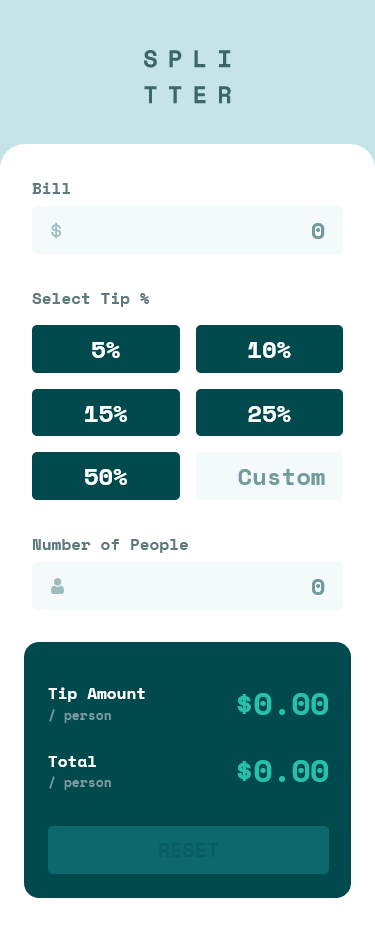
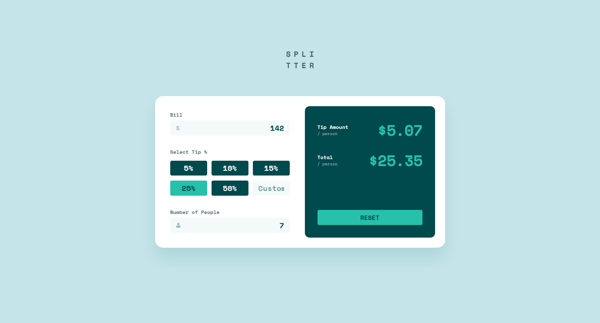

# Frontend Mentor - Tip calculator app solution

This is a solution to the [Tip calculator app challenge on Frontend Mentor](https://www.frontendmentor.io/challenges/tip-calculator-app-ugJNGbJUX). Frontend Mentor challenges help you improve your coding skills by building realistic projects!

## Table of contents

- [Overview](#overview)
  - [The challenge](#the-challenge)
  - [Screenshot](#screenshot)
  - [Links](#links)
- [My process](#my-process)
  - [Built with](#built-with)
  - [What I learned](#what-i-learned)
  - [Continued development](#continued-development)
  - [Useful resources](#useful-resources)
- [Author](#author)

## Overview

### The challenge

Users should be able to:

- View the optimal layout for the app depending on their device's screen size
- See hover states for all interactive elements on the page
- Calculate the correct tip and total cost of the bill per person

### Screenshot

Solution in mobile 📱:


Solution in desktop 💻:


### Links

- Solution URL: [Click here](https://www.frontendmentor.io/solutions/mobilefirst-tip-calculator-app-with-js-owDHrnCqD)
- Live Site URL: [See live site here](https://juanbonilla.me/FEM_tip-calculator-app/)

## My process

### Built with

- Semantic HTML5 markup
- CSS / SCSS custom properties
- Flexbox
- CSS Grid
- Mobile-first workflow
- JavaScript

### What I learned

This challenge help me review some basic concepts that I haven't practiced in a long time. 

First, I did want to use modules in my project to practice and understand again how to split my JavaScript code a let it be more easy to mantain. In this way, I started wondering how I could achive this, I decided to use my knowledge in 'export' and 'import' syntax but I didn't get the result I was expecting. I was getting the following error: `Reason: CORS request is not HTTP`. So, I began looking for the meaning of this error. I finally obtained the answer, I needed to implement a local webserver for testing and using ES6+ modules; also, the use of `type="module"` as an attribute for the tag that was calling the main JS file in the HTML was fundamental:

```html
<script type="module" src="script.js"></script>
```

Then, I was able to start debugging my JS code. With this, I got another question: How can I prevent the user to write specific characters in my textboxes?. To solve this, I tried with some event listeners for keyboard input such as `keydown, `keyup` and `keypress`, but none of them was doing what I wanted. Finally, I decided searching for other options and I found out the event listener `input` which was the one that helped me. Check how I implemented this below:

```js
/* Code for Bill textbox */
const bill = document.getElementById('bill');
// Remove any value at the first rendering or when the page is reloaded
bill.value = ''; 
const errorBill = document.getElementById('error-bill');

bill.addEventListener('input', ({target}) => {
  // Check if the user input is correct, else show an error message
  checkChanges(target, errorBill, regEx);
  // Check if a calculation could be possible
  checkCalc();
});
```
Next, I was lucky and by chance a video appeared to call my attention and discover how to use Event Delegation. I found this very useful due to a use case this challenge provided, the tip percentage buttons was a perfect scenario to apply the concept. Event Delegation is something great because it passes an event listener to its children avoid the need of creating the same event listener child by child. You can see how I did this in the following code snippet:

```js
/* Code for Tip buttons elements */
const tipButtons = document.getElementById('tip-buttons');

// If an event listener is added to the parent component all of its children will get one too 
tipButtons.addEventListener('click', (e) => {
  // As the tip buttons parent has buttons tag and one input
  // it's necessary to validate if there is a target element and if that element is a BUTTON
  if ( e.target && e.target.tagName === 'BUTTON' ) {
    // Set the tip value with the select value of the button 
    tipValue = parseInt(e.target.value);
    customTip.value = '';
    // Disable active class for other buttons
    setInactiveButtons();
    // Check if a calculation could be possible
    checkCalc();
    e.target.classList.toggle(btnActiveClass);
  }
});
```
Finally, I wanted to highligh the need of obtaining a value with only two decimals for the result of the calculator. I remembered the `toFixed()` function; even though, I noticed this function was rounding the values of the decimals in the calculation. Because of that, I went looking for other solutions, functions or options to obtain what I wanted and avoid the default result of that function. I got the answer in a forum and this is what I decided to put in my code to get the final value as exact as possible:

```js
/* Tip Calculator */ 
const getNumberWithDecimals = (num) => (Math.floor(100 * num)/100).toFixed(2);
```

### Continued development

I want to continue having challenges like this to start wondering on different ways of solving them. This one made my search more and go back to basics but also, I feel like I did a good work. However, I consider I still need to figure out how to avoid creating so many lines of code and reuse more instead.

### Useful resources

- [JavaScript Modules with Import/Export Syntax (ES6)](https://www.youtube.com/watch?v=s9kNndJLOjg) - This was really helpful! I was checking the way of creating modules in my project to avoid having everything in one file and get the possibility of code a file that contains functions or variables that I can use for other projects.
- [How do you set up a local testing server?](https://developer.mozilla.org/en-US/docs/Learn/Common_questions/set_up_a_local_testing_server) - Because I wanted to use modules in my project, I deal with an issue, this was a problem with CORS that prevented my code from running properly. The solution was to configure a local web server, this article explains easily how to do it.
- [On iput event](https://www.w3schools.com/jsref/event_oninput.asp) - I was trying to figure out some way of validating the user input in my text fields to prevent filling these with invalid data. I tried with `keypress`, `keydown` and `keyup`, but the answer was finally with the use of `input` listener.
- [Event delegation](https://www.youtube.com/watch?v=GUTt0qKUDyU&ab_channel=FalconMasters) - A great video which explains how to create event listeners in the best way possible and put best practices in action.
- [How to prevent toFixed from rounding off decimals](https://stackoverflow.com/questions/10808671/javascript-how-to-prevent-tofixed-from-rounding-off-decimal-numbers) - I was looking for some way of getting just two decimals as a result of my calculations. The `toFixed()` function works at the beginning until I found it was rounding my decimals, I did not want that so this forum show me what I was trying to obtain.
- [Position last flex item at the end of the container ](https://stackoverflow.com/questions/33924655/position-last-flex-item-at-the-end-of-container) - I consider this is very basic but the challenge made my think about different ways of solving how to position the Reset button at the end. So, I implemented `display: flex` with `flex-direction: column` and the use of `margin-top: auto` to push my button to the end of my container.
- [Last-child not working as expected](https://stackoverflow.com/questions/18995362/last-child-not-working-as-expected/42036523) - This helped me to understand how the `:last-child` pseudo-class works. I wanted to get the last element of an specific tag, but this did not work as I was expecting until I reach out with this explanation.
- [nth-last-child() selector](https://stackoverflow.com/questions/9227932/css-last-child-1) - This forum problem complements what I was looking for in the before link. This shows how to get an specific child starting from the end contrary to the `nth-last-child`.

## Author

- Website - [juanbonilla.me](https://juanbonilla.me)
- Frontend Mentor - [@juanpb96](https://www.frontendmentor.io/profile/juanpb96)
- LinkedIn - [Juan Bonilla](https://www.linkedin.com/in/juan-pablo-bonilla-6b8730115/)
